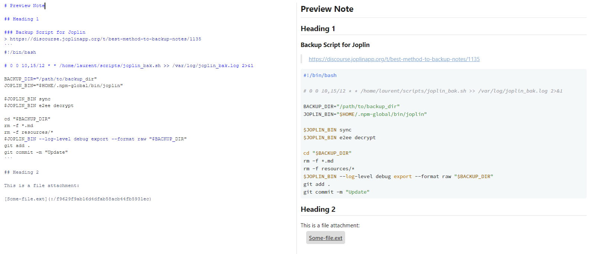

# custom style for Joplin

[Joplin](https://joplinapp.org) is an open source note taking app. You can create custom styles for the app itself as well as for the rendered Markdown preview pane.

This is a fork of the custom styles of @devonzuegel with some tweaks on the markdown style.

To fully make use of my changes, install the font *Source Code Pro* as this is used as the code font.

**Notable changes:**
- code / code blocks font
- file attachments
- bottom border on h2
- Katex expressions aligned to the left

I have also expanded on the very smart resizing of images with the title tag by devonzuegel to include more sizes. To make use of this just append the size as a title in the image attachment:

``

This will render the image with a width of 800px.

**Preview**

